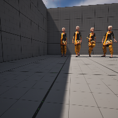

# Project Name  GAME1116-1

## Description

A github repository for the in class demonstration code.   
 
## Usage
Clone, or download the zip, to a local directory. Open in Unreal Engine 5.4 or newer

## Attributions

1) Avro Arrow model, Helijah at SketchFab, ( https://skfb.ly/BnyU )
2) shield icon, OpenGameArt, ( https://opengameart.org/content/shield-2 )
3) pavement PBR, FreePBR, ( https://freepbr.com/product/pebbled-asphalt1/ )
4) Crystal Cave (song18), CynicMusic at OpenGameArt.org, Background music, ( https://opengameart.org/content/crystal-cave-song18 )
6) Worn out brick wall, FreePBR, ( https://freepbr.com/product/worn-out-old-brick-wall-pbr-material/ )
7) pavement material, FreePBR, ( https://freepbr.com/product/pebbled-asphalt1/ )
8) Zebra, African Animal Variety pack,UE Market Place, ( https://www.unrealengine.com/marketplace/en-US/product/17c2d7d545674204a7644c3c0c4c58ba )

